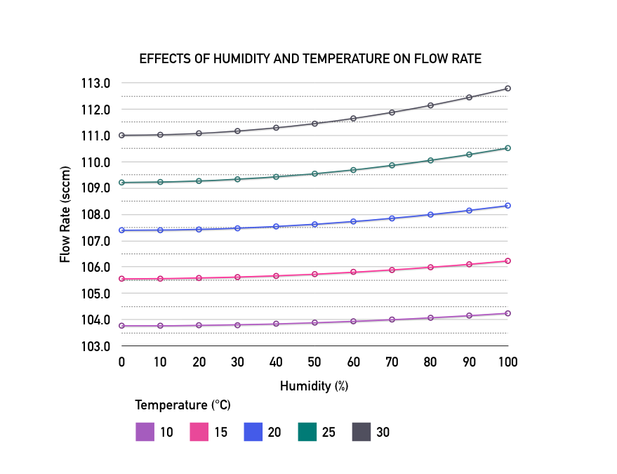

### Background ###
Humidity and temperature affect the flow of a gas. To correct for these effects, it is necessary to determine what rate to set the flow of a gas at in order to have that gas move at the expected or intended rate. Below is a graph showing the effects of humidity and temperature on air.


## How to Use

The program will prompt you to give the name of the gas (either the name or symbol, not case sensitive), the temperature, and the relative humidity. Or, the user can just hit enter and skip over the options and default setting for all will be used.

### How to Run

```
python flow_calc.py
```

### User Input

```
Enter the gas name; ex: Chlorine or Cl2
> (name)
```
```
Enter the temperature as a number in degrees C; ex: 10 for 10 degrees C
> (temperature)
```
```
Enter the humidity as a number; ex: 50 for 50%
> (humidity)
```
```
Enter the desired flow rate as a number in sccm; ex: 100 sccm
> (flow rate)
```

## Examples

### Input

```
Enter the gas name; ex: Chlorine or Cl2
> air
```
```
Enter the temperature as a number in degrees C; ex: 10 for 10 degrees C
> 0
```
```
Enter the humidity as a number; ex: 50 for 50%
> 100
```
```
Enter the desired flow rate as a number in sccm; ex: 100 sccm
> 100
```

### Output

The program will return the flow rate to set as well as statistics on the gas used in the measurement process.
```
----------------------------------------------------
  SET GAS FLOW TO: 90.8605600173791 sccm
  
  Gas name:     Air
  Temperature:  15
  Humidity:     50
  Desired Flow: 100
  Density:      1.22087512021
  GCF:          1.091394399826209
=====================================================
```
## Author
Nicole Trappe 2019

## References
1. https://www.mksinst.com/n/gas-correction-factors-for-thermal-based-mass-flow-controllers
2. https://www.mksinst.com/n/flow-measurement-control-frequently-asked-questions
3. https://www.omnicalculator.com/physics/air-density
4. https://www.weather.gov/epz/wxcalc_vaporpressure
5. http://hvac-calculator.com/wet_air_density.php?temp=25&hum=20&pres=1013
6. https://www.engineeringtoolbox.com/air-specific-heat-capacity-d_705.html
7. https://www.engineeringtoolbox.com/ammonia-heat-capacity-specific-temperature-pressure-Cp-Cv-d_2016.html
8. https://www.engineeringtoolbox.com/density-air-d_680.html
9. https://engineering.dartmouth.edu/microeng/equipment/RTA/gas.calibration.html
10. https://io9.gizmodo.com/what-is-the-speed-of-smell-5831558
11. https://jeb.biologists.org/content/212/22/3633
12. https://www.experimentalaircraft.info/flight-planning/aircraft-navigation-speed.php
13. https://www.quora.com/How-does-air-pressure-and-density-affect-the-speed-of-airplanes
14. https://physics.stackexchange.com/questions/262541/how-cold-air-is-less-dense-in-one-case-and-more-dense-in-another-case-when-compa/262556
15. https://www.quora.com/How-does-air-pressure-and-density-affect-the-speed-of-airplanes
